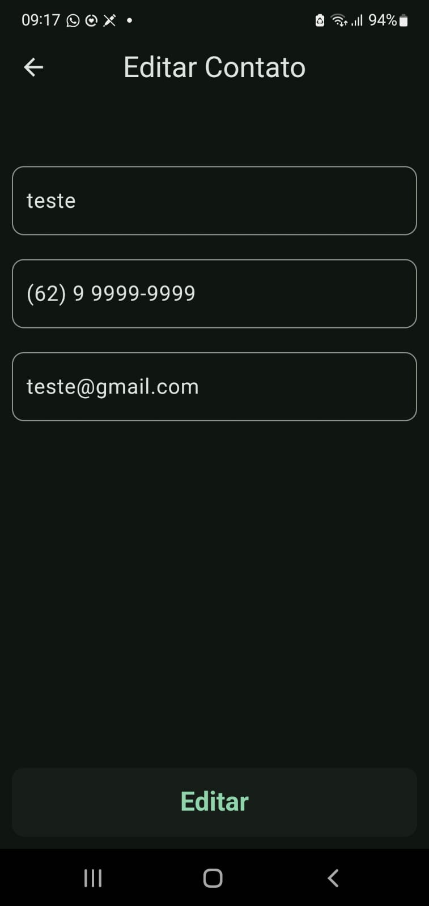

## PROJETO INTEGRADOR PUC GOIAS

## Apresentação:

[](https://www.youtube.com/watch?v=Pii5CTJ9Elg)

## Instalação:

Para rodar o projeto, é necessário ter o Flutter instalado em sua máquina. Caso não tenha, siga as instruções no link abaixo:

https://flutter.dev/docs/get-started/install

Após a instalação do Flutter, clone o repositório em sua máquina:

```bash
git clone <link do repositorio>
```

Acesse a pasta do projeto:

```bash
cd pi_puc
```

Instale as dependências do projeto:

```bash
flutter pub get
```

Execute o projeto:

```bash
flutter run
```


## Documentação:

## Visão Geral

Este repositório contém uma aplicação desenvolvida em Dart, que possibilita ao usuário fazer alterações em um banco de dados local(Neste caso, o Isar) utilizando conceitos CRUD ( Create (Criar), Read (Ler), Update (Atualizar) e Delete (Apagar)). Que se trata de um Projeto universitário da PUC-GO com foco em uso de boas práticas.

O projeto desenvolvido pela equipe trata-se de um app de lista de contatos, onde o usuário pode consultar, adicionar, modificar e excluir contatos, estes que guardam informações como nome, email e telefone.

A aplicação segue o paradigma de Programação Orientada à Objetos utilizando a tecnologia Dart com o framework Flutter aliado ao Isar Database.
## Funcionalidades

- Temas dark e light.
- Adição, exclusão, modificação e consulta de Contatos diretamente ao Banco de Dados através de uma interface simples e amigável.
- Cross-plataform (Aindroid e IOS).

## Estrutura do Código

- android e ios: Configurações específicas das plataformas.

- lib/src: Código fonte do app, contendo arquivos e subpastas que implementam as principais funcionalidades.

- Bidings: são usados para gerenciar dependências, inicializar controladores, repositórios e APIs sem a necessidade de chamá-los diretamente na View. 

- Helpers:  usados para consultas de inserção, atualização, exclusão e consulta. 

- Local_storage: permite armazenar pequenas quantidades de dados, como strings, ints, doubles, bools e stringLists, foi implementado utilizando Shared Preferences.

- UI: Arquivo contendo os códigos da "Interface de Usuário" do App.

- Models: Contém a classe que representa o "Contato" e todo o código gerado automaticamente pelo IsarCollectionGenerator.

- Modules/home: Contém os arquivos de todas as Telas do App

- Main: É o ponto de entrada do aplicativo. A função principal realiza as seguintes tarefas:

WidgetsFlutterBinding.ensureInitialized();
Garante que a ligação com os widgets do Flutter esteja inicializada antes de executar qualquer código que dependa disso (como inicializar um banco de dados ou carregar recursos).

Isar.initializeIsarCore();
Inicializa o núcleo do banco de dados Isar, que é um banco de dados local usado para armazenar dados no dispositivo.

runApp(const PiPuc());
Inicia o aplicativo Flutter com o widget raiz PiPuc.

- pubspec.yaml:onde são declaradas as dependências do projeto, como bibliotecas externas e assets (imagens, fontes, etc). Ele também contém informações como a versão Dart, nome, descrição, versão do projeto, etc. 

- pubspec.lock:bloqueia as versões para as quais pode ser feito o upgrade. Isso ajuda a evitar problemas de compatibilidade e garante que todos os que trabalham no projeto usem a mesma versão do código. 

- analysis_options.yaml: Regras de lint para o código.

- README.md: Documento introdutório básico(Este arquivo).

- .gitignore e .metadata: Arquivos para versionamento

## CRUD

### Como as funcionalidades do CRUD foram implementadas

Em nosso projeto, o BD utilizado foi o ISAR, semelhante ao Hive, que por sua vez, faz as implementações de código do SQL de forma automatizada

 (contida em lib/src/models/contact.g.dart).

As funcionalidades CRUD implementadas foram:

 **Create (Criar)**:
   - A funcionalidade de criação geralmente envolve a inserção de novos registros no banco de dados. No código, isso é feito através de formulários onde os dados são enviados para uma rota específica que lida com a criação. Por exemplo, uma rota POST pode ser usada para receber os dados e inserir um novo registro na tabela correspondente.

 **Read (Ler)**:
   - A leitura de dados é implementada através de consultas ao banco de dados. Isso pode ser visto em rotas GET que recuperam dados e os exibem em uma página ou retornam um JSON. Essas rotas geralmente utilizam funções que executam consultas SQL para buscar os registros necessários.

 **Update (Atualizar)**:
   - A atualização de registros é feita através de rotas PUT ou PATCH. Essas rotas recebem os dados atualizados e identificam o registro a ser modificado, geralmente através de um ID. O código então executa uma consulta SQL para atualizar os campos do registro no banco de dados.

 **Delete (Excluir)**:
   - A exclusão de registros é realizada através de rotas DELETE. Essas rotas recebem um identificador do registro a ser excluído e executam uma consulta SQL para remover o registro do banco de dados.

## Screenshots
Tela de Adição de Novos Contatos.


Tela de Lista de Contatos(Vazia).


Tela de Teste de Adição de Contatos com Campos Vazios(Erro).


Tela de Teste de Adição de Contatos de campo com informações inválidas(Erro).


Telas de Confirmação de Contato salvo com sucesso.


Tela com opções de alteração de contato(Alteração e exclusão de dados)


Tela de Edição de Contatos.



tela de Confirmação de Exclusão de Contatos.


Tela de Confirmação de Exclusão de Contatos.


## Integrantes

- José Augusto Soares de Moura

- Natal Lucas Ribeiro de Paula

- Carlos Vinicius Bressani

- Ernandes Yosimura

